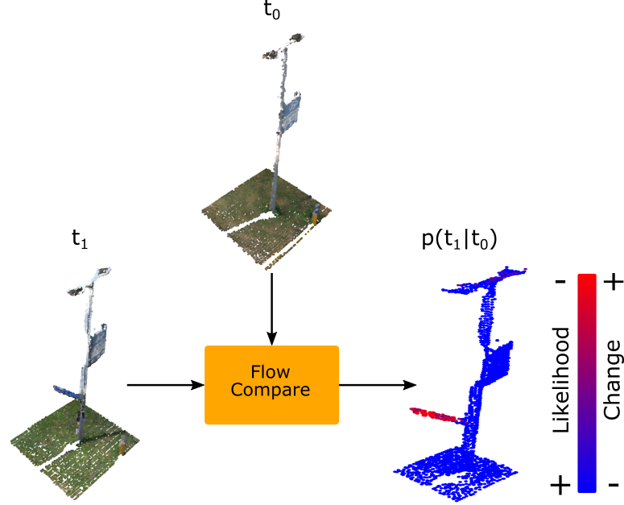
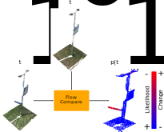

# Flow Compare: Conditional Normalizing Flows for Point Cloud Change Detection

Msc Thesis - S.J. Galanakis, Utrecht University 2021

In collaboration with [Cyclomedia](https://www.cyclomedia.com/en).

Report [download](https://dspace.library.uu.nl/handle/1874/404960)

For any questions you can contact me at [samme.galanakis6@gmail.com](mailto:samme.galanakis6@gmail.com)

<!--  -->

## Abstract

Despite significant progress in 3D deep learning for tasks such as classification and semantic segmentation, robust change detection techniques for complex, coloured environments have not been developed.
This is in part due to the absence of labelled change detection datasets
and the inherent difficulty of constructing such datasets despite the
abundance of unlabeled data. Flow Compare is a fully unsupervised
approach that leverages expressive generative models with iterative
attention trained on multi-temporal coloured point clouds. Change
detection is achieved by reframing the problem as anomaly detection given a learnt conditional distribution. Training pairs are formed
by co-registered multi-temporal extracts from coloured point cloud
scenes. The inherent class imbalance due to the rarity of semantically
important change, which is problematic for supervised approaches,
is here harnessed to guarantee that relevant changes are considered
anomalies under the learnt distribution. This approach shows promise
in detecting not only geometric change but also colour change whilst
being robust to common semantically unimportant change.

## Installation

All dependencies are listed in the environment.yml file in the root directory and can be loaded through anaconda. Code has only been tested on linux.
Training was performed on an A100-40GB GPU so lower memory gpu's will likely require changing at least the batch size in the configs.

For the pretrained models and preprocessed data the following folder must be [downloaded](https://drive.google.com/drive/folders/1nF8r-ij3aJ-MQGxJa7b3mrcjofDq40LU?usp=sharing) and put in a 'save' folder in the root directory. Html files that render full 3D versions of the examples
found in the report are in the examples folder.
The original data was provided by Cyclomedia and is not made available. The provided data is what was used for training and is a significantly downsampled version as detailed in the accompanying report.

## Pretrained models - configs

| Embedder Type     | Nats | Extra Context | Name |
| -------------     | ------------- | ------------- | ------------- |
| DGCNN Global      |  1.737  |No  |good-surf |
| PACONV Attention  |  2.034  |No  |helpful-sponge  |
| DGCNN Attention   | 2.125   |Yes  |swept-energy  |
| DGCNN Attention   |2.144    |No  |summer-terrain  |
| DGCNN Attention   |**2.222**   |Yes  |dulcet-universe  |

Here name refers to the saved parameters file name (save/conditional_flow_compare/) and the corresponding config name (config/). The configs are also saved within the save file itself. 

## Training from scratch

Copy one of the existing configs, change parameter values and run the train function of train.py given the correct config path. Logging is done with [wandb](https://wandb.ai/) and also logs generatd point clouds at certain intervals as set in the config.

## Calculating nats on test set
Run function evaluate_test of test_flow.py given the initialized model_dict as show in the file. The function returns average nats and mean change list which gives the percentage of change points as each index, so highest change values can be inspected through the dataset_viewer

## Viewing results on test/train dataset

Run visualize_change of test_flow.py as shown in the file. Open the local dash server link and then use the provided interface. By default the relative std based change values are shown and can be controlled by the multiplier slider.
If hard_cutoff value is inserted (set to 5 to reproduce examples from report) the multiplier parameter is ignored. Gen std does controls the standard deviation used for the generated point clouds.

## Code resources used

This project includes code adapted from various helpful resources (as noted in the files themselves) but chielfy from: [survae_flows](https://github.com/didriknielsen/survae_flows/), [perceiver-pytorch](https://github.com/lucidrains/perceiver-pytorch)] and [torch-geometric](https://github.com/rusty1s/pytorch_geometric).